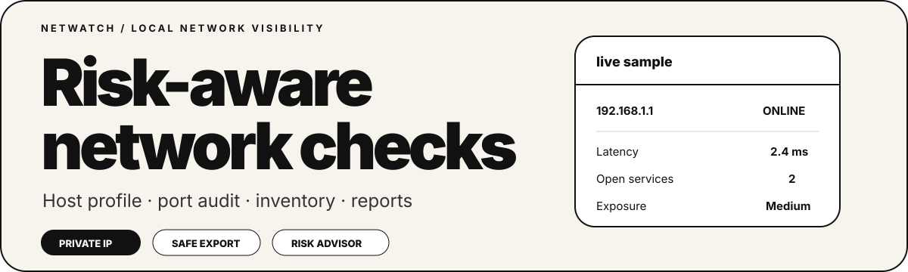

# NetWatch



NetWatch is a local network monitoring dashboard built with Python and Streamlit.

I made it as a practical cybersecurity/networking portfolio project. It is not a hacking tool; it is an admin-style dashboard for checking a local network, seeing which hosts respond, reviewing a short list of common services, saving a local inventory, exporting reports, and generating local advisory notes.

> Use it only on networks you own or where you have clear permission.

## What changed in v0.5.2

This version keeps the advisory feature neutral and product-style:

- Renamed the advisor page to **Risk Advisor**
- Added `advisory_engine.py`
- Added `docs/advisory-engine.md`
- Added `tests/test_advisory_engine.py`
- Updated exports to `netwatch_advisor_notes.md`
- Updated app labels, documentation, and security notes

## What changed in v0.5.1

This version focuses on security hardening:

- Dynamic text is cleaned before entering custom Streamlit HTML cards
- CSV exports are sanitized to reduce spreadsheet formula-injection risk
- Safety page documents UI/export safety controls
- Added `safe_text.py` and `export_utils.py`
- Added tests for safe text rendering and safe CSV export
- Added `docs/security-hardening.md`

## Main features

- Ping one private/local IP address
- Show latency, TTL, hostname and OS hint for host checks
- Scan a local CIDR range such as `192.168.1.0/24`
- Audit common TCP ports such as SSH, HTTP, HTTPS, SMB, MySQL, RDP and PostgreSQL
- Show service description, common role, response time and device role hint
- Use Risk Advisor to summarize risk and next actions
- Block public Internet targets from the app
- Save local assets and last-seen data in SQLite
- Show exposure score, level and top recommendations
- Export hosts, ports, inventory and advisor notes
- Generate Markdown and HTML reports
- Keep a local history of checks

## Security notes

NetWatch includes several defensive controls:

- Public IP targets are blocked by validation logic.
- CIDR scans have a maximum host limit.
- Scan actions require explicit permission confirmation.
- Dynamic values used in custom UI cards are cleaned first.
- CSV exports reduce spreadsheet formula-injection risk.
- HTML reports escape table values before export.
- Generated local files are ignored by Git.
- The Risk Advisor is local and does not send data outside the machine.

## Company-ready documentation

The repository includes handover and deployment material so the project can be reviewed more easily by a company or internship supervisor:

- `docs/company-handover.md`
- `docs/demo-script.md`
- `docs/deployment.md`
- `docs/security-review.md`
- `docs/security-hardening.md`
- `docs/acceptance-checklist.md`
- `docs/architecture.md`
- `docs/advisory-engine.md`
- `docker-compose.yml`
- GitHub issue templates

## Accuracy notes

NetWatch gives local visibility, not absolute truth:

- Latency and TTL depend on ICMP replies.
- Hostname depends on reverse DNS availability.
- Device role is a hint based on open ports, not guaranteed identification.
- Firewalls can make services appear closed or filtered.
- The Risk Advisor is local and rule-based; it helps explain results but does not replace a full security audit.
- The port list is intentionally short and defensive.

## Pages

- **Overview**: latest metrics, risk chart and recent saved runs
- **Network Scan**: checks which local hosts respond
- **Host Check**: tests one IP address and shows profile details
- **Port Audit**: checks common services and shows detailed recommendations
- **Risk Advisor**: summarizes results, priorities and next steps
- **Inventory**: saved local assets from previous checks
- **Network Tools**: quick CIDR/subnet helper
- **Reports**: Markdown and HTML report export
- **Safety**: project limits and allowed use cases

## Why I built it

I wanted a project related to what I study: networks, security basics, and Python. NetWatch helped me practice:

- Python modules and clean file structure
- Streamlit interface design
- IP and CIDR validation
- Socket basics
- Ping output parsing
- Service catalog mapping
- SQLite storage
- Local advisory logic
- CSV/Markdown/HTML report generation
- Defensive security thinking
- GitHub project organization

## Tech stack

- Python
- Streamlit
- Pandas
- Plotly
- SQLite
- Pytest
- GitHub Actions
- Docker

## Project structure

```text
NetWatch/
├── advisory_engine.py
├── app.py
├── config.py
├── export_utils.py
├── history_store.py
├── host_profiler.py
├── inventory_store.py
├── logger.py
├── network_scanner.py
├── network_tools.py
├── ping_checker.py
├── port_scanner.py
├── report_builder.py
├── risk_engine.py
├── safe_text.py
├── security.py
├── service_catalog.py
├── requirements.txt
├── README.md
├── SECURITY.md
├── CONTRIBUTING.md
├── CHANGELOG.md
├── Dockerfile
├── docker-compose.yml
├── Makefile
├── assets/
│   └── netwatch-banner-v2.svg
├── data/
│   └── sample_hosts.csv
├── docs/
│   ├── acceptance-checklist.md
│   ├── advisory-engine.md
│   ├── architecture.md
│   ├── company-handover.md
│   ├── demo-script.md
│   ├── deployment.md
│   ├── run-on-kali.md
│   ├── security-hardening.md
│   └── security-review.md
└── tests/
    ├── test_advisory_engine.py
    ├── test_export_utils.py
    ├── test_host_profiler.py
    ├── test_network_tools.py
    ├── test_report_builder.py
    ├── test_risk_engine.py
    ├── test_safe_text.py
    ├── test_service_catalog.py
    └── test_security.py
```

## Installation

Clone the repository:

```bash
git clone https://github.com/Adam-Ghanem/NetWatch.git
cd NetWatch
```

Create a virtual environment:

```bash
python -m venv venv
```

Activate it.

Windows:

```bash
venv\Scripts\activate
```

Linux/macOS:

```bash
source venv/bin/activate
```

Install dependencies:

```bash
pip install -r requirements.txt
```

Run the app:

```bash
streamlit run app.py
```

Open the local URL shown by Streamlit, usually:

```text
http://localhost:8501
```

## Kali / fish shell quick run

```fish
python3 -m venv venv
source venv/bin/activate.fish
python -m pip install --upgrade pip
pip install -r requirements.txt
python -m streamlit run app.py
```

## Docker

```bash
docker build -t netwatch .
docker run -p 8501:8501 netwatch
```

## Docker Compose

```bash
docker compose up -d --build
```

## Tests

```bash
pytest -q
```

## Next improvements

- Add PDF export after the HTML report
- Add screenshots from a real lab run
- Add optional authentication for shared deployments
- Add a small SQLite cleanup/export tool
- Add manually editable asset owner/location fields
- Add company policy mapping for private deployments

## Disclaimer

This project is for learning and authorized defensive testing only. Do not check networks or devices without permission.
