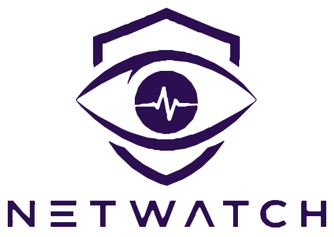
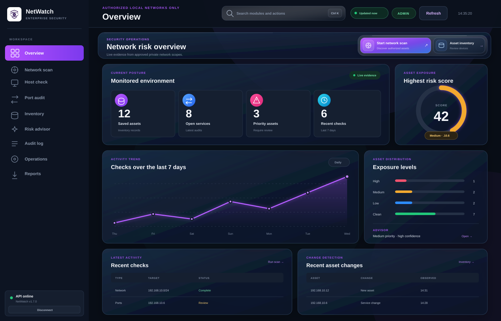
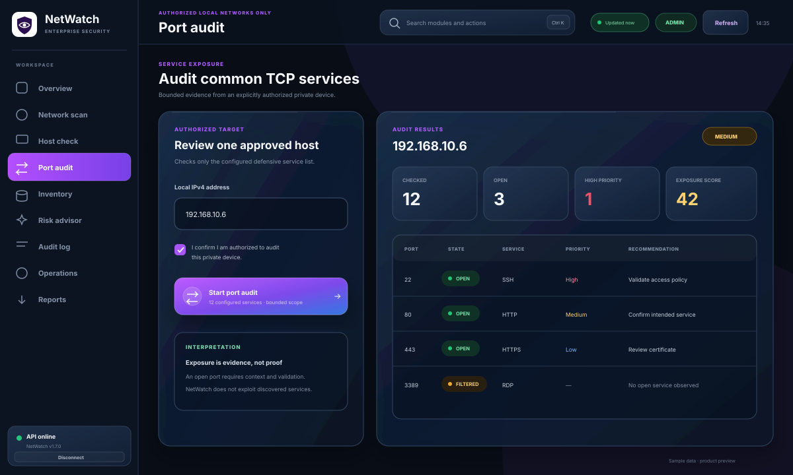
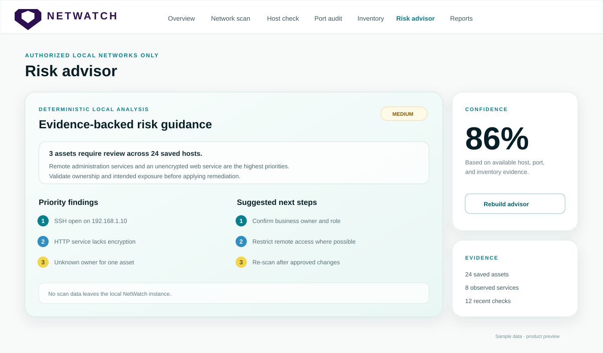

<p align="center">
  
</p>

<h1 align="center">NetWatch</h1>

<p align="center">
  Local-first network visibility and defensive review for authorized environments.
</p>

<p align="center">
  <a href="https://github.com/Adam-Ghanem/NetWatch/actions/workflows/python-ci.yml"></a>
  <a href="https://github.com/Adam-Ghanem/NetWatch/actions/workflows/security-ci.yml"></a>
  <a href="https://codecov.io/gh/Adam-Ghanem/NetWatch"></a>
  
  <a href="LICENSE"></a>
</p>

NetWatch is a Python, FastAPI, SQLite, and browser-based dashboard for local network visibility. It helps an authorized operator discover local hosts, profile devices, review common TCP services, maintain an asset inventory, generate deterministic risk guidance, and export evidence-backed reports.

> Use NetWatch only on networks and devices you own or are explicitly authorized to assess.

## Product preview

The previews below use sample data and do not contain real network identifiers.

### Overview



<table>
  <tr>
    <td width="50%"></td>
    <td width="50%"></td>
  </tr>
  <tr>
    <td align="center"><strong>Port audit</strong></td>
    <td align="center"><strong>Risk advisor</strong></td>
  </tr>
</table>

Capture guidance for future screenshots and short demos is documented in [`docs/screenshots/README.md`](docs/screenshots/README.md).

## NetWatch v1.0

The default product is a responsive light corporate dashboard served together with the protected FastAPI API at one local address:

```text
http://127.0.0.1:8000
```

The original Streamlit interface remains available as an optional legacy profile, but it is no longer the default product UI.

## Highlights

- Responsive light corporate dashboard
- User-provided NetWatch identity and local SVG assets
- Session-only API-key connection screen
- Authorized local IPv4 CIDR discovery
- Single-host latency, TTL, hostname, and cautious OS hints
- Bounded concurrent common-port audit
- Clear Open, Closed, and Filtered/Unreachable states
- SQLite asset inventory and scan history
- Exposure priority score and deterministic local Risk Advisor
- Markdown and standalone HTML report downloads
- Public, oversized, and unsupported targets blocked
- API authentication, rate limits, scan concurrency limits, and security headers
- Non-root Docker container with localhost-only publishing
- One-command secure launcher
- Automated Python, frontend, API, Compose, Docker, and coverage validation

## Start NetWatch

### Requirements

- Git
- Python 3.10+
- Docker Desktop or Docker Engine with Docker Compose

### Clone and launch

```bash
git clone https://github.com/Adam-Ghanem/NetWatch.git
cd NetWatch
python scripts/start.py
```

The launcher automatically:

1. Creates a local `.env` file.
2. Generates a strong random API key.
3. Builds the NetWatch container.
4. Starts it on `127.0.0.1:8000`.
5. Prints the dashboard URL and API key.

Open the displayed URL and enter the displayed key. The browser stores the key only in session storage, so closing the tab clears it.

## Manual Docker deployment

Create the environment file and generate a secret:

```bash
cp .env.example .env
python -c "import secrets; print(secrets.token_urlsafe(32))"
```

Put the generated value in `.env`:

```text
NETWATCH_API_KEY=your-generated-secret
```

Start NetWatch:

```bash
docker compose up -d --build netwatch
```

Useful commands:

```bash
docker compose ps
docker compose logs -f netwatch
docker compose restart netwatch
docker compose down
```

## Main workflows

### Overview

Shows saved assets, open services, assets requiring review, recent checks, and a compact advisor summary.

### Network scan

Checks an approved local IPv4 CIDR with a maximum of 256 hosts. ICMP filtering may hide active devices, so a zero-host result does not prove that the network is empty.

### Host check

Profiles one approved IPv4 host and displays:

- Reachability
- Round-trip latency
- TTL
- Reverse-DNS hostname
- Cautious operating-system hint
- Observation notes

### Port audit

Reviews a short defensive list of common TCP services and displays:

- Open, Closed, or Filtered/Unreachable state
- Response time
- Service description
- Exposure priority
- Review recommendation
- Device-role hint

An open port is exposure that requires context and validation. It is not automatic proof of a vulnerability.

### Inventory and history

Stores local assets, timestamps, status, open-service findings, exposure score, and recent scan runs in SQLite.

### Risk Advisor

Builds a deterministic local summary from saved evidence. It does not send scan data to an external AI or cloud service.

### Reports

Downloads:

- Markdown report for GitHub, notes, or handover documents
- Standalone HTML report for review and sharing inside an authorized environment

## Architecture

```text
Responsive dashboard (`frontend/`)
              |
              v
Protected FastAPI application (`backend/main.py`)
              |
    +---------+----------+
    |         |          |
Validation  Scanners   Risk Advisor
    |         |          |
    +---------+----------+
              |
              v
       SQLite + reports
```

The FastAPI process serves both the dashboard and the `/api/*` endpoints. This same-origin design avoids unnecessary cross-origin complexity and gives the project one clear production-style entry point.

## Security model

NetWatch applies defense in depth:

- `X-NetWatch-Key` required for all non-health API endpoints
- Protected operations disabled until `NETWATCH_API_KEY` is configured
- Server-side `authorized: true` required for scan requests
- Explicit local IPv4 allowlists
- Public and unsupported IPv6 targets rejected
- CIDR scans limited to 256 hosts
- Rate limiting per client and endpoint
- One simultaneous scan by default
- Restricted CORS origins
- Content Security Policy
- `X-Frame-Options: DENY`
- `X-Content-Type-Options: nosniff`
- API responses marked `no-store`
- CSV and HTML export sanitization
- Non-root Docker user
- Docker port published only on `127.0.0.1`
- No exploitation, brute force, credential testing, stealth, persistence, or evasion functionality

The health endpoint is public so Docker and local operators can verify service availability. Inventory, scan, history, advisor, and report endpoints require authentication.

## API examples

Health:

```bash
curl http://127.0.0.1:8000/api/health
```

Authorized network scan:

```bash
curl -X POST http://127.0.0.1:8000/api/scan/network \
  -H "Content-Type: application/json" \
  -H "X-NetWatch-Key: YOUR_LOCAL_KEY" \
  -d '{"cidr":"192.168.1.0/24","authorized":true}'
```

Authorized port audit:

```bash
curl -X POST http://127.0.0.1:8000/api/audit/ports \
  -H "Content-Type: application/json" \
  -H "X-NetWatch-Key: YOUR_LOCAL_KEY" \
  -d '{"ip":"192.168.1.1","authorized":true}'
```

## Local development

Create a virtual environment and install development dependencies:

```bash
python -m venv .venv
source .venv/bin/activate
python -m pip install --upgrade pip
python -m pip install -r requirements-dev.txt
pre-commit install
```

On Windows PowerShell:

```powershell
.venv\Scripts\Activate.ps1
```

Run the application:

Linux/macOS:

```bash
export NETWATCH_API_KEY="development-only-secret"
uvicorn backend.main:app --host 127.0.0.1 --port 8000 --reload
```

Windows PowerShell:

```powershell
$env:NETWATCH_API_KEY="development-only-secret"
uvicorn backend.main:app --host 127.0.0.1 --port 8000 --reload
```

The original Streamlit UI is optional:

```bash
docker compose --profile legacy up -d streamlit
```

## Configuration

| Variable | Default | Purpose |
|---|---:|---|
| `NETWATCH_API_KEY` | empty | Required secret for protected operations |
| `NETWATCH_ALLOWED_ORIGINS` | localhost port 8000 | Browser CORS allowlist |
| `NETWATCH_API_DOCS` | `false` | Enables FastAPI docs for local development |
| `NETWATCH_MAX_CONCURRENT_SCANS` | `1` | Simultaneous scan limit |
| `NETWATCH_RATE_LIMIT_REQUESTS` | `30` | Requests per endpoint/window |
| `NETWATCH_RATE_LIMIT_WINDOW_SECONDS` | `60` | Rate-limit window |
| `NETWATCH_PORT_SCAN_WORKERS` | `12` | Bounded TCP review workers |
| `NETWATCH_DATA_DIR` | `data` | SQLite data directory |

## Data storage

SQLite is the main operational store:

```text
data/netwatch.db
```

The database uses WAL mode, busy timeout, UTC timestamps, and indexes. Docker Compose persists it in a named volume.

The older CSV history remains only for compatibility with the optional Streamlit interface.

## Tests, coverage, and code quality

Install the development toolchain:

```bash
make dev-install
```

Run checks locally:

```bash
make test
make coverage
make lint
make typecheck
make pre-commit
node --check frontend/app.js
docker compose config --quiet
docker build -t netwatch-local .
```

Quality configuration is centralized in:

- `pyproject.toml`
- `.flake8`
- `.pre-commit-config.yaml`
- `requirements-dev.txt`
- `codecov.yml`

GitHub Actions validates Python tests and coverage, dependency consistency, Python source compilation, frontend JavaScript syntax, Docker Compose configuration, the production container build, dashboard/static asset serving, API authentication, CORS, security headers, and local target restrictions.

Network actions are mocked in API tests, so CI does not scan external systems.

## Accuracy limitations

NetWatch provides useful local evidence, not absolute truth:

- ICMP discovery can miss hosts that block ping
- Reverse DNS may not return a hostname
- TTL-based OS hints are approximate
- Firewalls can affect Closed and Filtered results
- Device roles are inferred from observed services
- The port list is intentionally short
- IPv6 scanning is rejected until correctly implemented
- Important findings should be validated with the device or network owner

## Project structure

```text
NetWatch/
├── backend/
│   ├── __init__.py
│   └── main.py
├── frontend/
│   ├── assets/
│   ├── index.html
│   ├── styles.css
│   └── app.js
├── scripts/
│   ├── __init__.py
│   └── start.py
├── tests/
├── docs/
│   └── screenshots/
├── app.py                  # optional legacy Streamlit UI
├── advisory_engine.py
├── config.py
├── host_profiler.py
├── inventory_store.py
├── network_scanner.py
├── port_scanner.py
├── report_builder.py
├── risk_engine.py
├── security.py
├── service_catalog.py
├── pyproject.toml
├── requirements.txt
├── requirements-dev.txt
├── .pre-commit-config.yaml
├── .env.example
├── Dockerfile
├── docker-compose.yml
└── Makefile
```

## Roadmap

- Per-scan normalized host and service findings
- Historical scan comparison and change detection
- Local CVE enrichment with explicit version-confidence handling
- ARP discovery where operating-system permissions allow
- Progress updates and cancellation for longer scans
- Editable owner, location, and business context for assets
- PDF reports
- Safe public demo mode with sample data and scanning disabled
- Organization authentication for shared deployments

## Contributing

Read [`CONTRIBUTING.md`](CONTRIBUTING.md) before opening a pull request. The project accepts defensive improvements, tests, documentation, accessibility work, performance improvements, and carefully scoped local-security features.

## License

NetWatch is released under the [MIT License](LICENSE).

## Disclaimer

NetWatch is a defensive local visibility tool. Use it only with clear authorization. The default deployment is designed for one local operator and must not be exposed publicly without TLS, stronger identity controls, network restrictions, secret management, logging, and a deployment-specific security review.
