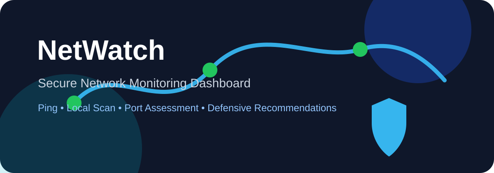

# NetWatch - Secure Network Monitoring Dashboard



NetWatch is a professional, beginner-friendly cybersecurity and networking dashboard built with **Python** and **Streamlit**. It helps students, network technicians, and cybersecurity learners monitor authorized local networks, check host availability, assess common open ports, and export simple reports.

> **Ethical use only:** NetWatch is designed for private/local networks you own or have explicit permission to test.

## Highlights

- Secure-by-default local/private target validation
- Clean Streamlit dashboard
- Authorized local network ping sweep
- Single-host ping checker
- Conservative common TCP port scanner
- Risk classification for open services
- Practical hardening recommendations
- CSV export for findings
- Local activity logging
- Professional GitHub structure with tests, Dockerfile, CI, and security policy

## Screenshots

Add screenshots after running the app:

```text
screenshots/dashboard.png
screenshots/network-scan.png
screenshots/port-scan.png
```

## Tech Stack

- Python
- Streamlit
- Pandas
- Plotly
- Socket
- Subprocess
- ThreadPoolExecutor
- Pytest

## Project Structure

```text
NetWatch/
├── app.py
├── config.py
├── logger.py
├── network_scanner.py
├── ping_checker.py
├── port_scanner.py
├── security.py
├── requirements.txt
├── README.md
├── SECURITY.md
├── CONTRIBUTING.md
├── Dockerfile
├── Makefile
├── LICENSE
├── .gitignore
├── .streamlit/
│   └── config.toml
├── .github/
│   └── workflows/
│       └── python-ci.yml
├── assets/
│   └── banner.svg
├── data/
│   └── sample_hosts.csv
├── screenshots/
│   └── .gitkeep
└── tests/
    └── test_security.py
```

## Installation

```bash
git clone https://github.com/Adam-Ghanem/NetWatch.git
cd NetWatch
python -m venv venv
```

### Windows

```bash
venv\Scripts\activate
pip install -r requirements.txt
streamlit run app.py
```

### Linux/macOS

```bash
source venv/bin/activate
pip install -r requirements.txt
streamlit run app.py
```

## Docker

```bash
docker build -t netwatch .
docker run -p 8501:8501 netwatch
```

Then open:

```text
http://localhost:8501
```

## Usage

1. Open the Streamlit dashboard.
2. Go to **Ping Checker** to test one private/local IP.
3. Go to **Network Scan** and enter a CIDR such as `192.168.1.0/24`.
4. Go to **Port Scanner** to check common ports on an authorized host.
5. Return to **Dashboard** to review metrics and export CSV reports.

## Security Safeguards

NetWatch intentionally includes safety restrictions:

- Private/local IP addresses only
- Maximum network scan size limit
- Conservative common port list
- Explicit authorization checkbox before scanning
- No exploitation, brute force, credential attacks, or stealth behavior
- Risk-based defensive recommendations

## Example Use Cases

- Student cybersecurity lab
- Home network visibility
- Router/service check
- Internship portfolio project
- Basic network administration practice

## Roadmap

- PDF report export
- Device history database
- Authentication for shared deployments
- Dark/light theme switch
- More detailed local asset inventory
- Optional Nmap import parser

## Disclaimer

This tool is provided for educational and authorized defensive testing only. Do not scan networks or devices without permission.
